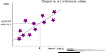

## Classification and regression

The classification makes predictions about which category a dataset belongs to.

In a 2-dim diagram the two axes present the features. The decision boundary divides the area depending on the category.

>

 

In contrast the regression predicts a continuous value as output. Here it is shown in 2-dim.

 

>

_Reference:  
Classification and regression by ischmahl from the repo [machine-learning-OER-Basics](https://github.com/Machine-Learning-OER-Collection/Machine-Learning-OER-Basics) is licensed under [CC-BY 4.0](https://creativecommons.org/licenses/by/4.0/)._
