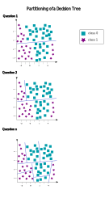

<!--
SPDX-FileCopyrightText: 2023 Machine-Learning-OER-Collection
SPDX-License-Identifier: CC-BY-4.0
-->
## Decision Tree Algorithm

Decision trees are used for classification and regression. This example focuses on classification. 

First, the terminology:
A decision tree consists of a root, edges, nodes and leaf nodes:
A root has nodes, a node always has an ancestor and descendants and a leaf has no descendants.  

The goal is to create a model that predicts the value of a target variable by learning simple decision rules (if/else) inferred from the features of the data. 

To understand how the if/else questions lead to a tree structure, let's have a look at this simple example:

Let's say we have the features: age, miles, color, model and type. The color can be white, black, or silver. The type can be electro or gas and so on.

The decision tree starts with a question at the top. If the answer of the question is True, take the left path and if it's False, take the right path.

If the question is True, the next question is asked. If the answer is True again, the final decision is already made (Buy). 

However, if the question is False, follow the "False" path. And the next question will be asked.

The decision tree keeps branching out based on the questions and answers until reaching a final prediction. Each branch of the tree represents a decision based on the features of the car. 

By the end, the data set is partitioned into Buy (Class 0) and Don't Buy (Class 1). 

_Reference:  
decision tree algorithm by julia from the repo [machine-learning-OER-Basics](https://github.com/Machine-Learning-OER-Collection/Machine-Learning-OER-Basics) is licensed under [CC-BY 4.0](https://creativecommons.org/licenses/by/4.0/)._
