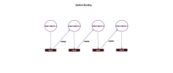

## Gradient Boosting Algorithm

Boosting is an ensemble method that adapts a sequence of weak learners to repeatedly modified versions of the data. The predictions of the weak learners are then combined by a weighted majority vote to produce the final prediction. The gradient boosting algorithm is a particular boosting method. It builds the model additively. At each step, negative gradient values are fitted to the loss function.

- Weak learner: Also called base classifier, like shallow trees, are combined. By default, sklearn uses 100 so-called decision stumps as weak learners.
- Loss function or cost function: The goal is to minimize the loss function, which is a global measure of the loss or error occurring in any available decisions.

Gradient Boosted Trees often use shallow trees with a depth of one to five, which reduces memory requirements and speeds up prediction. However, they are more sensitive to parameter adjustments than random forests. Nevertheless, they can provide improved accuracy if the parameters are chosen optimally.

_Reference:  
gradient boosting algorithm by julia from the repo [machine-learning-OER-Basics](https://github.com/Machine-Learning-OER-Collection/Machine-Learning-OER-Basics) is licensed under [CC-BY 4.0](https://creativecommons.org/licenses/by/4.0/)._
