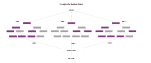

## Random Forest Classifier

Random forests are a tree-based model that can be used for classification and regression.

A random forest is an ensemble of decision trees. 
Each tree is built completely independently, and the algorithm makes different random choices for each tree to ensure that the trees are different.
The random forest algorithm uses the majority vote of the results of each decision tree to predict the class of a sample.

_Reference:  
random forest classifier by julia from the repo [machine-learning-OER-Basics](https://github.com/Machine-Learning-OER-Collection/Machine-Learning-OER-Basics) is licensed under [CC-BY 4.0](https://creativecommons.org/licenses/by/4.0/)._
