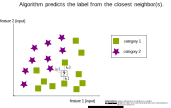
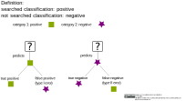
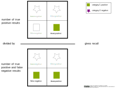

# Images for nearest neighbors algorithm

### Principle of classification

---

### Principle of regression

---

### knn algorithm

---

### Overfitting

---

### Underfitting

---

### Optimal fitting

---

### Finding the optimal k value

---

### Error types

---

### Confusion matrix for a binary classification

---

### Accurac

---

### Precision

---

### Recall

---

### F1 score

---

### Multi-class confusion matrix

