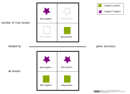

<!--
SPDX-FileCopyrightText: 2023 Machine-Learning-OER-Collection
SPDX-License-Identifier: CC-BY-4.0
-->
## Accuracy

The accuracy is the ratio of true predictions divided by all predictions and describes how correct a model works. However, it only gives a good insight for balanced datasets. This fact is described by the accuracy paradox.

For example, we have a distribution with class 1 of 90 % and class 2 of 10 %. By always predicting class 1, the accuracy is 0.9. In this case the value does not give any information about the prediction reliability of the model.

 

>

 

#### Code example:

An overview about the main metrics for a classification problem can be obtained with the function classification_report.

    from sklearn.metrics import classification_report
    y_pred = knn_clf.predict(X_test)
    target_names = ['specie 1', 'specie 2', 'specie 3']
    print(classification_report(y_test, y_pred, target_names=target_names))

(Reference: Example code for a knn classification by ischmahl from the repo [machine-learning-OER-Basics](https://github.com/Machine-Learning-OER-Collection/Machine-Learning-OER-Basics) licensed under [CC-BY 4.0](https://creativecommons.org/licenses/by/4.0/).)

_Reference:  
Accuracy by ischmahl from the repo [machine-learning-OER-Basics](https://github.com/Machine-Learning-OER-Collection/Machine-Learning-OER-Basics) is licensed under [CC-BY 4.0](https://creativecommons.org/licenses/by/4.0/)._
