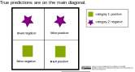

<!--
SPDX-FileCopyrightText: 2023 Machine-Learning-OER-Collection
SPDX-License-Identifier: CC-BY-4.0
-->
## Confusion matrix for a binary classification

A clear visualization of all possible prediction options for a binary classification is provided by the confusion matrix. On the main diagonal are the true predictions.

 

>

 

#### Code example:
    from sklearn.metrics import confusion_matrix
    confusion = confusion_matrix (y_test, y_pred)
    print(confusion)

(Reference: Example code for a knn classification by ischmahl from the repo [machine-learning-OER-Basics](https://github.com/Machine-Learning-OER-Collection/Machine-Learning-OER-Basics) licensed under [CC-BY 4.0](https://creativecommons.org/licenses/by/4.0/).)

_Reference:  
Confusion matrix for a binary classification  by ischmahl from the repo [machine-learning-OER-Basics](https://github.com/Machine-Learning-OER-Collection/Machine-Learning-OER-Basics) is licensed under [CC-BY 4.0](https://creativecommons.org/licenses/by/4.0/)._
