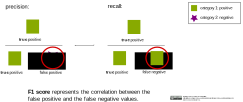

## F1 Score

The F1 Score correlates the precision and the recall. A high F1 Score can only be achieved, if the values for false positive and for false negative predictions are both low.   

 

>

 

It is calculated by the harmonic mean:

F1 = 2 * (precision * recall / precision + recall)

#### Code example:

An overview about the main metrics for a classification problem can be obtained with the function classification_report.

    from sklearn.metrics import classification_report
    y_pred = knn_clf.predict(X_test)
    target_names = ['specie 1', 'specie 2', 'specie 3']
    print(classification_report(y_test, y_pred, target_names=target_names))

(Reference: Example code for a knn classification by ischmahl from the repo [machine-learning-OER-Basics](https://github.com/Machine-Learning-OER-Collection/Machine-Learning-OER-Basics) licensed under [CC-BY 4.0](https://creativecommons.org/licenses/by/4.0/).)

_Reference:  
F1 Score by ischmahl from the repo [machine-learning-OER-Basics](https://github.com/Machine-Learning-OER-Collection/Machine-Learning-OER-Basics) is licensed under [CC-BY 4.0](https://creativecommons.org/licenses/by/4.0/)._
