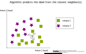

<!--
SPDX-FileCopyrightText: 2023 Machine-Learning-OER-Collection
SPDX-License-Identifier: CC-BY-4.0
-->
## knn algorithm

The knn algorithm predicts the category for the new dataset from the labels of the k nearest neighbors. The value of k is set before.

 

>

 

#### Code example for k=1:
    from sklearn.neighbors import KNeighborsClassifier
    knn_clf = KNeighborsClassifier(n_neighbors=1)
    knn_clf.fit(X_train, y_train)
    knn_clf.predict(X_test)
    knn_clf.score(X_test, y_test)   

(Reference: Example code for a knn classification by ischmahl from the repo [machine-learning-OER-Basics](https://github.com/Machine-Learning-OER-Collection/Machine-Learning-OER-Basics) licensed under [CC-BY 4.0](https://creativecommons.org/licenses/by/4.0/).)

_Reference:  
knn algorithm by ischmahl from the repo [machine-learning-OER-Basics](https://github.com/Machine-Learning-OER-Collection/Machine-Learning-OER-Basics) is licensed under [CC-BY 4.0](https://creativecommons.org/licenses/by/4.0/)._
