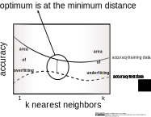

<!--
SPDX-FileCopyrightText: 2023 Machine-Learning-OER-Collection
SPDX-License-Identifier: CC-BY-4.0
-->
## Find optimal k value

The optimal model for a knn algorithm is derived from viewing the accuracy of the training and test data as a function of the k value.
* If the k value is too small, there is a high accuracy in the training data. This means overfitting.
* If the k value is too large, there is a low accuracy in the training data. This means underfitting.
* The optimal k value is found at the position where the distance between the two curves becomes minimal.

 

>

 

#### Code example:

    neighbors_settings = range(1,20)
    training_accuracy = []
    test_accuracy = []

    for n_neighbors in neighbors_settings:
        knn = KNeighborsClassifier(n_neighbors=n_neighbors)
        knn.fit(X_train, y_train)
        training_accuracy.append(knn.score(X_train, y_train))
        test_accuracy.append(knn.score(X_test, y_test))

(Reference: Example code for a knn classification by ischmahl from the repo [machine-learning-OER-Basics](https://github.com/Machine-Learning-OER-Collection/Machine-Learning-OER-Basics) licensed under [CC-BY 4.0](https://creativecommons.org/licenses/by/4.0/).)

_Reference:  
Find optimal k value by ischmahl from the repo [machine-learning-OER-Basics](https://github.com/Machine-Learning-OER-Collection/Machine-Learning-OER-Basics) is licensed under [CC-BY 4.0](https://creativecommons.org/licenses/by/4.0/)._
