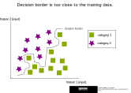
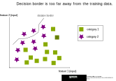
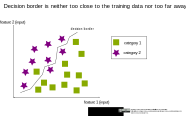

## Overfitting and underfitting

* Overfitting means, that the decision border runs too close to the area of the training data. This gives too much importance to outliers and makes the model difficult to generalize to new datasets.

* Underfitting means, that the decision borders runs too far away from the area of the training data. The model is too general and takes too little account of the characteristics of the data.

* In the optimum case, the decision border is neither too close to the area of the training data nor too far away from it.

_Reference:  
Overfitting and underfitting by ischmahl from the repo [machine-learning-OER-Basics](https://github.com/Machine-Learning-OER-Collection/Machine-Learning-OER-Basics) is licensed under [CC-BY 4.0](https://creativecommons.org/licenses/by/4.0/)._
