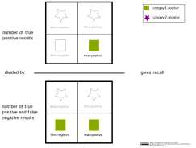

## Recall

The recall is the ratio of true positive predictions to all predictions of the searched classification (true positive and false negative ones). Increasing the recall means reducing the rate of false negative predictions.

 

>

 

#### Code example:

An overview about the main metrics for a classification problem can be obtained with the function classification_report.

    from sklearn.metrics import classification_report
    y_pred = knn_clf.predict(X_test)
    target_names = ['specie 1', 'specie 2', 'specie 3']
    print(classification_report(y_test, y_pred, target_names=target_names))

(Reference: Example code for a knn classification by ischmahl from the repo [machine-learning-OER-Basics](https://github.com/Machine-Learning-OER-Collection/Machine-Learning-OER-Basics) licensed under [CC-BY 4.0](https://creativecommons.org/licenses/by/4.0/).)

_Reference:  
Recall by ischmahl from the repo [machine-learning-OER-Basics](https://github.com/Machine-Learning-OER-Collection/Machine-Learning-OER-Basics) is licensed under [CC-BY 4.0](https://creativecommons.org/licenses/by/4.0/)._
