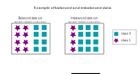

## Sampling Methods

Sampling methods are used to balance imbalanced data sets.

**Balanced and imbalanced data**

Imbalanced data sets contain more samples of one class than from the other classes. 
This may lead to a classifier biased toward the majority class, resulting in poor performance on unseen data.

The class with fewer samples is called the minority class, and the dominant classes are the majority. 

Balanced data sets contain an equal amount of samples per class. 

>

 

__This non-exhaustive list shows an excerpt of methods to deal with unbalanced data:__

Data Level:
- Sampling Methods:

    - Oversampling
    - Undersampling

Algorithm Level:
- Cost-sensitive Learning

Feature Selection Level:
- Filter Based Feature Ranking

Balancing a data set should always be done after splitting into training and test set. Never balance the test set.

 

The manipulation of imbalanced data sets has an impact on the performance of the model. This tutorial uses the **RandomUnderSampler**, **RandomOverSampler** and **BalancedRandomForestClassifier** techniques to handle the imbalanced data set. For different methods, see the [imbalanced-learn](https://imbalanced-learn.org/stable/references/index.html) documentation.

****

The [RandomUnderSampler](https://imbalanced-learn.org/stable/references/generated/imblearn.under_sampling.RandomUnderSampler.html) will under-sample the majority class(es) by randomly selecting samples with or without replacement.

The [RandomOverSampler](https://imbalanced-learn.org/stable/references/generated/imblearn.over_sampling.RandomOverSampler.html) will over-sample the minority class(es) by taking random samples with replacement.

The [BalancedRandomForestClassifier](https://imbalanced-learn.org/stable/references/generated/imblearn.ensemble.BalancedRandomForestClassifier.html#balancedrandomforestclassifier) combines the sampling technique with the ensemble concept. In this method, the majority class is downsampled and each tree is built using a more balanced data set.

_Reference:  
data_sets by julia from the repo [machine-learning-OER-Basics](https://github.com/Machine-Learning-OER-Collection/Machine-Learning-OER-Basics) is licensed under [CC-BY 4.0](https://creativecommons.org/licenses/by/4.0/)._
