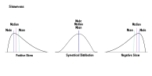

<!--
SPDX-FileCopyrightText: 2023 Machine-Learning-OER-Collection
SPDX-License-Identifier: CC-BY-4.0
-->

### Statistical Measure

**Skewness**

Skewness is a statistical measure that describes the type and strength of asymmetry in a probability distribution. Any non-symmetric distribution is skewed, right-skewed or left-skewed. You can also speak of positive (right) or negative (left) skewness or symmetrical distribution. Right skewness means that the outliers are to the right; for the left skewness, the outliers are to the left.

>

 

**Selection of terms of Descriptive Statistics**

_mode_ | the most frequent value in a data set - if you don't find a value that appears more often than all the others, the data set has no mode

_median_ | the middle value in a group of ordered values in a data set - list all the values in numerical order from smallest to largest, if there is an even number of values, the median is the mean of the two middle values

_mean_ | the average of a group of values in a data set - add up all the numbers and then divide by the amount of numbers

_Reference:  
statistical_measure by julia from the repo [machine-learning-OER-Basics](https://github.com/Machine-Learning-OER-Collection/Machine-Learning-OER-Basics) is licensed under [CC-BY 4.0](https://creativecommons.org/licenses/by/4.0/)._